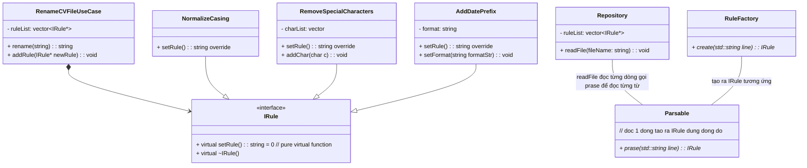

```mermaid
classDiagram
    class RenameCVFileUseCase {
        - ruleList: vector~IRule*~
        + rename(string): string
        + addRule(IRule* newRule): void
    }

    class IRule {
        <<interface>>
        + virtual setRule(): string = 0 // pure virtual function
        + virtual ~IRule()
    }

    RenameCVFileUseCase *--> IRule

    class NormalizeCasing {
        + setRule(): string override
    }
    NormalizeCasing --|> IRule

    class RemoveSpecialCharacters {
        - charList: vector<char>
        + setRule(): string override
        + addChar(char c): void
    }
    RemoveSpecialCharacters --|> IRule

    class AddDatePrefix {
        - format: string
        + setRule(): string override
        + setFormat(string formatStr): void
    }
    AddDatePrefix --|> IRule

    class Repository {
        - ruleList: vector~IRule*~
        + readFile(fileName: string): void
    }

    class Parsable {
        // doc 1 dong tao ra IRule dung dong do
        + prase(std::string line): IRule*
    }

    Repository -- Parsable : readFile đọc từng dòng gọi prase để đọc từng từ

    class RuleFactory {
        + create(std::string line): IRule*
    }
    RuleFactory -- Parsable : tạo ra IRule tương ứng

```