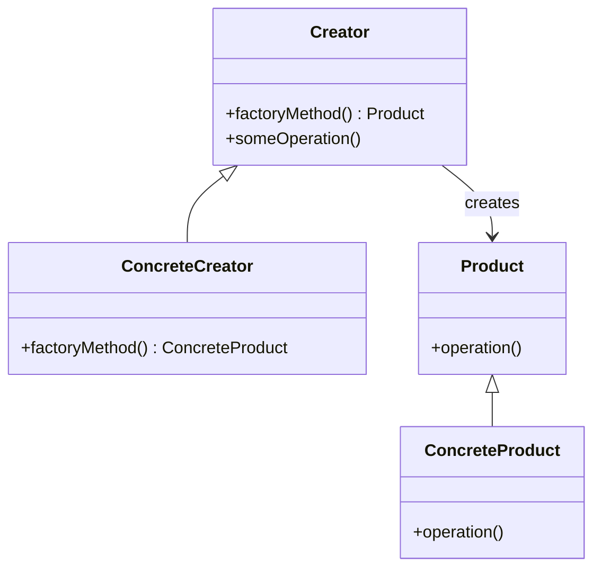

## Factory Method Pattern (Phương thức Nhà máy)

**1. Design Pattern đó là gì? (What is it?)**

*   **Tên gọi khác:** Virtual Constructor.
*   **Loại Pattern:** Creational Pattern (Mẫu thiết kế khởi tạo).
*   **Mục đích cốt lõi:** Định nghĩa một interface (giao diện) để tạo một đối tượng, nhưng **để các lớp con (subclasses) quyết định lớp cụ thể (concrete class) nào sẽ được khởi tạo.** Factory Method cho phép một lớp trì hoãn việc khởi tạo đối tượng cho các lớp con của nó.

Nói cách khác, thay vì lớp cha trực tiếp tạo đối tượng bằng toán tử `new ConcreteProduct()`, nó gọi một "phương thức nhà máy" (factory method). Lớp con sẽ override phương thức nhà máy này để trả về một instance của lớp sản phẩm cụ thể mà nó muốn tạo.

**2. Vấn đề nó giải quyết (Problem it solves):**

*   Bạn muốn một lớp có thể tạo các đối tượng, nhưng bạn không biết trước chính xác loại đối tượng nào cần tạo lúc thiết kế. Loại đối tượng có thể phụ thuộc vào cấu hình, lựa chọn của người dùng, hoặc các điều kiện lúc runtime.
*   Bạn muốn cung cấp cho người dùng của thư viện/framework của bạn một cách để mở rộng các thành phần bên trong nó bằng cách cung cấp các lớp sản phẩm tùy chỉnh của riêng họ mà không cần sửa đổi code của thư viện/framework.
*   Bạn muốn giảm sự phụ thuộc trực tiếp vào các lớp cụ thể trong code của client. Client chỉ làm việc với interface của sản phẩm và interface của factory.

**3. Cách triển khai (How to implement?):**

Cấu trúc điển hình bao gồm các thành phần sau:

*   **`Product` (Sản phẩm - Interface/Abstract Class):**
    *   Định nghĩa interface cho các đối tượng mà factory method sẽ tạo ra.
    *   Ví dụ: `IVehicle`, `IDocument`.

*   **`ConcreteProduct` (Sản phẩm cụ thể - Concrete Class):**
    *   Các lớp triển khai interface `Product`. Đây là các đối tượng thực sự được tạo ra.
    *   Ví dụ: `Car`, `Truck` (triển khai `IVehicle`); `WordDocument`, `PdfDocument` (triển khai `IDocument`).

*   **`Creator` (Người tạo - Abstract Class hoặc Concrete Class với virtual factory method):**
    *   Khai báo factory method, phương thức này trả về một đối tượng kiểu `Product`.
    *   `Creator` cũng có thể định nghĩa một triển khai mặc định cho factory method (trả về một `ConcreteProduct` mặc định).
    *   Thường chứa các logic nghiệp vụ liên quan đến `Product`. Nó gọi factory method để tạo đối tượng `Product` khi cần.
    *   Ví dụ: `VehicleFactory`, `DocumentCreator`.

*   **`ConcreteCreator` (Người tạo cụ thể - Concrete Class):**
    *   Override factory method để trả về một instance của một `ConcreteProduct` cụ thể.
    *   Ví dụ: `CarFactory` (override để tạo `Car`), `WordDocumentCreator` (override để tạo `WordDocument`).

**Sơ đồ UML cơ bản:**



**Luồng hoạt động:**

1.  Client gọi một phương thức trên `Creator` (ví dụ `someOperation()`).
2.  Bên trong `Creator`, khi cần một đối tượng `Product`, nó gọi `factoryMethod()`.
3.  Nếu `Creator` là một lớp trừu tượng, hoặc nếu `factoryMethod()` là thuần ảo, thì phiên bản của `factoryMethod()` trong `ConcreteCreator` sẽ được thực thi.
4.  `ConcreteCreator::factoryMethod()` tạo và trả về một instance của `ConcreteProduct`.
5.  `Creator` nhận được `ConcreteProduct` (dưới dạng con trỏ `Product*`) và sử dụng nó.

**4. Khi nào nên áp dụng (When to apply?):**

*   Khi một lớp không thể đoán trước được lớp của các đối tượng mà nó phải tạo.
*   Khi một lớp muốn các lớp con của nó chỉ định các đối tượng mà nó tạo ra.
*   Khi bạn muốn bản địa hóa việc tạo đối tượng vào một nơi duy nhất và cung cấp một cách linh hoạt để thay đổi loại đối tượng được tạo.
*   Khi bạn muốn cung cấp cho người dùng khả năng mở rộng thư viện/framework của bạn.

**5. Ưu điểm (Pros):**

*   **Linh hoạt và khả năng mở rộng cao:** Dễ dàng thêm các loại sản phẩm mới và các factory tương ứng mà không cần sửa đổi code client hoặc creator hiện có (tuân thủ Open/Closed Principle).
*   **Giảm sự phụ thuộc (Decoupling):** Code client chỉ làm việc với interface `Product` và `Creator`, không phụ thuộc vào các lớp `ConcreteProduct` và `ConcreteCreator`.
*   **Mã nguồn rõ ràng hơn:** Logic tạo đối tượng được tập trung vào các factory method, làm cho code của `Creator` trở nên gọn gàng hơn.
*   **Cho phép các lớp con quyết định:** Quyền quyết định lớp cụ thể nào được tạo ra được trao cho các lớp con.

**6. Nhược điểm (Cons):**

*   **Tăng số lượng lớp:** Cần phải tạo một hệ thống phân cấp `Creator` song song với hệ thống phân cấp `Product`, có thể dẫn đến nhiều lớp hơn trong hệ thống.
*   Đôi khi, nếu chỉ có một vài `ConcreteProduct` và logic tạo đơn giản, việc sử dụng Factory Method có thể là thừa thãi (over-engineering).

**7. Ví dụ minh họa (Illustrative Example):**

Hãy xem xét một ứng dụng cần tạo các loại phương tiện giao thông khác nhau (Xe hơi, Xe tải).

```cpp
#include <iostream>
#include <string>
#include <memory> // For std::unique_ptr

// --- Product Interface ---
class IVehicle {
public:
    virtual ~IVehicle() {} // Quan trọng: Hàm hủy ảo
    virtual void drive() const = 0;
    virtual std::string getType() const = 0;
};

// --- Concrete Products ---
class Car : public IVehicle {
public:
    void drive() const override {
        std::cout << "Driving a Car..." << std::endl;
    }
    std::string getType() const override {
        return "Car";
    }
};

class Truck : public IVehicle {
public:
    void drive() const override {
        std::cout << "Driving a Truck..." << std::endl;
    }
    std::string getType() const override {
        return "Truck";
    }
};

class Bicycle : public IVehicle {
public:
    void drive() const override {
        std::cout << "Riding a Bicycle..." << std::endl;
    }
    std::string getType() const override {
        return "Bicycle";
    }
};


// --- Creator (Abstract Class) ---
class VehicleFactory {
public:
    virtual ~VehicleFactory() {} // Hàm hủy ảo

    // The Factory Method
    virtual std::unique_ptr<IVehicle> createVehicle() const = 0;

    // Phương thức này sử dụng factory method
    void deliverVehicle() const {
        std::unique_ptr<IVehicle> vehicle = createVehicle();
        std::cout << "Delivering a " << vehicle->getType() << "." << std::endl;
        vehicle->drive();
    }
};

// --- Concrete Creators ---
class CarFactory : public VehicleFactory {
public:
    std::unique_ptr<IVehicle> createVehicle() const override {
        return std::make_unique<Car>();
    }
};

class TruckFactory : public VehicleFactory {
public:
    std::unique_ptr<IVehicle> createVehicle() const override {
        return std::make_unique<Truck>();
    }
};

class BicycleFactory : public VehicleFactory {
public:
    std::unique_ptr<IVehicle> createVehicle() const override {
        return std::make_unique<Bicycle>();
    }
};


// --- Client Code ---
void clientCode(const VehicleFactory& factory) {
    std::cout << "Client: I'm not aware of the creator's concrete class, but it still works." << std::endl;
    factory.deliverVehicle();
}

int main() {
    std::cout << "App: Launched with the CarFactory." << std::endl;
    CarFactory car_factory;
    clientCode(car_factory);

    std::cout << "\nApp: Launched with the TruckFactory." << std::endl;
    TruckFactory truck_factory;
    clientCode(truck_factory);

    std::cout << "\nApp: Launched with the BicycleFactory." << std::endl;
    BicycleFactory bicycle_factory;
    clientCode(bicycle_factory);

    return 0;
}
```

**Output của ví dụ:**

```
App: Launched with the CarFactory.
Client: I'm not aware of the creator's concrete class, but it still works.
Delivering a Car.
Driving a Car...

App: Launched with the TruckFactory.
Client: I'm not aware of the creator's concrete class, but it still works.
Delivering a Truck.
Driving a Truck...

App: Launched with the BicycleFactory.
Client: I'm not aware of the creator's concrete class, but it still works.
Delivering a Bicycle.
Riding a Bicycle...
```

**Giải thích ví dụ:**

*   `IVehicle` là interface `Product`.
*   `Car`, `Truck`, `Bicycle` là các `ConcreteProduct`.
*   `VehicleFactory` là `Creator` trừu tượng, có `createVehicle()` là factory method thuần ảo. Nó cũng có phương thức `deliverVehicle()` sử dụng `createVehicle()`.
*   `CarFactory`, `TruckFactory`, `BicycleFactory` là các `ConcreteCreator`, mỗi cái override `createVehicle()` để tạo ra loại phương tiện cụ thể.
*   Hàm `clientCode` chỉ nhận vào một `VehicleFactory&` và gọi `deliverVehicle()`. Nó không cần biết factory cụ thể là gì, mà vẫn có thể nhận được đúng loại phương tiện.
*   Trong `main`, chúng ta tạo các instance của `ConcreteCreator` và truyền chúng vào `clientCode`.

**8. Bài tập ví dụ cụ thể (Exercise):**

**Bài tập: Hệ thống tạo Hình học (Shapes)**

Bạn hãy thiết kế một hệ thống sử dụng Factory Method để tạo các đối tượng hình học khác nhau (Hình tròn, Hình chữ nhật, Hình tam giác).

1.  **Yêu cầu:**
    *   **`IShape` (Product Interface):**
        *   `virtual void draw() const = 0;`
        *   `virtual double getArea() const = 0;`
        *   `virtual ~IShape() {}`

    *   **`Circle`, `Rectangle`, `Triangle` (Concrete Products):**
        *   Triển khai `IShape`.
        *   `Circle` có thuộc tính bán kính.
        *   `Rectangle` có thuộc tính chiều dài, chiều rộng.
        *   `Triangle` có thuộc tính 3 cạnh (hoặc đáy và chiều cao, tùy bạn chọn).
        *   Triển khai `draw()` (ví dụ: in ra "Drawing a Circle with radius X") và `getArea()`.

    *   **`ShapeFactory` (Creator - có thể là lớp trừu tượng hoặc lớp cụ thể với factory method ảo):**
        *   `virtual std::unique_ptr<IShape> createShape(/* có thể có tham số để quyết định loại hình */) const = 0;`
        *   Có thể có một phương thức `void processShape()` sử dụng `createShape()` để tạo hình, sau đó gọi `draw()` và `getArea()`.

    *   **`CircleFactory`, `RectangleFactory`, `TriangleFactory` (Concrete Creators):**
        *   Kế thừa từ `ShapeFactory`.
        *   Override `createShape()` để tạo ra `Circle`, `Rectangle`, hoặc `Triangle` tương ứng.
        *   Constructor của các factory này có thể nhận các tham số cần thiết để tạo hình (ví dụ: `CircleFactory` nhận bán kính).

2.  **Trong `main()`:**
    *   Tạo các instance của `CircleFactory`, `RectangleFactory`, `TriangleFactory` với các tham số thích hợp.
    *   Sử dụng các factory này để tạo các đối tượng hình học.
    *   Gọi `draw()` và `getArea()` trên các hình đã tạo.
    *   In kết quả ra màn hình.

**Gợi ý thêm cho bài tập:**

*   Bạn có thể thiết kế `ShapeFactory::createShape()` không nhận tham số, và các thông số của hình (bán kính, cạnh,...) được truyền vào constructor của `ConcreteCreator`.
*   Hoặc, `ShapeFactory::createShape()` có thể nhận một enum hoặc string để chỉ định loại hình, và `ShapeFactory` (lúc này là một lớp cụ thể, không phải trừu tượng) sẽ có một `switch-case` hoặc `if-else` bên trong `createShape()` để tạo đối tượng phù hợp. Đây là một biến thể đơn giản hơn của Factory Method, đôi khi được gọi là "Simple Factory" (mặc dù Simple Factory không hoàn toàn là một GoF pattern). Tuy nhiên, để thực hành đúng Factory Method, hãy ưu tiên cách các lớp con quyết định.

**Yêu cầu bài tập (Tóm tắt lại):**

Thiết kế hệ thống tạo các đối tượng hình học (Tròn, Chữ nhật, Tam giác) sử dụng Factory Method.
*   `IShape`: Interface cho các hình (có `draw()`, `getArea()`).
*   `Circle`, `Rectangle`, `Triangle`: Các lớp hình cụ thể.
*   `ShapeFactory`: Creator, có factory method `createShape()`.
*   `CircleFactory`, `RectangleFactory`, `TriangleFactory`: Concrete Creators.

**Bước 1: Định nghĩa Interface `IShape` (Product Interface)**

Đây là giao diện chung cho tất cả các hình học.

```cpp
// IShape.h (Nên tách ra file header)
#ifndef ISHAPE_H
#define ISHAPE_H

#include <iostream> // Cho std::ostream trong draw nếu cần
#include <string>   // Cho tên hoặc mô tả

// Forward declaration nếu cần (ví dụ: nếu IShape có phương thức nhận IShape khác)

class IShape {
public:
    virtual ~IShape() {} // Hàm hủy ảo quan trọng!

    virtual void draw() const = 0;          // Vẽ hình
    virtual double getArea() const = 0;     // Tính diện tích
    virtual std::string getName() const = 0; // Lấy tên hình (tùy chọn, hữu ích cho debug)
};

#endif // ISHAPE_H
```

**Giải thích:**

*   `virtual ~IShape() {}`: Hàm hủy ảo là **cực kỳ quan trọng** khi bạn có ý định xóa đối tượng thông qua con trỏ lớp cơ sở. Nếu không có nó, hàm hủy của lớp con có thể không được gọi, dẫn đến rò rỉ tài nguyên.
*   `draw() const = 0;`, `getArea() const = 0;`: Các phương thức thuần ảo. Bất kỳ lớp nào kế thừa `IShape` đều *phải* triển khai chúng. `const` được thêm vào vì các phương thức này không nên thay đổi trạng thái của đối tượng hình học.
*   `getName() const = 0;`: Thêm phương thức này để dễ dàng xác định loại hình khi hiển thị hoặc debug.

**Bước 2: Triển khai các Lớp Hình học Cụ thể (Concrete Products)**

**2.1. `Circle`**

```cpp
// Circle.h
#ifndef CIRCLE_H
#define CIRCLE_H

#include "IShape.h"
#include <cmath> // Cho M_PI (nếu có) hoặc tự định nghĩa PI
#include <iomanip> // Cho std::fixed, std::setprecision

const double PI = 3.1415926535; // Hoặc dùng M_PI từ cmath nếu được

class Circle : public IShape {
private:
    double radius;

public:
    Circle(double r) : radius(r) {
        if (r < 0) {
            // Bạn có thể ném một ngoại lệ ở đây hoặc xử lý khác
            std::cerr << "Warning: Circle radius cannot be negative. Using absolute value." << std::endl;
            this->radius = std::abs(r);
        }
    }

    void draw() const override {
        std::cout << "Drawing a Circle with radius: " << std::fixed << std::setprecision(2) << radius << std::endl;
    }

    double getArea() const override {
        return PI * radius * radius;
    }

    std::string getName() const override {
        return "Circle";
    }

    double getRadius() const { // Phương thức getter riêng của Circle
        return radius;
    }
};

#endif // CIRCLE_H
```

**2.2. `Rectangle`**

```cpp
// Rectangle.h
#ifndef RECTANGLE_H
#define RECTANGLE_H

#include "IShape.h"
#include <iomanip>

class Rectangle : public IShape {
private:
    double width;
    double height;

public:
    Rectangle(double w, double h) : width(w), height(h) {
        if (w < 0 || h < 0) {
            std::cerr << "Warning: Rectangle dimensions cannot be negative. Using absolute values." << std::endl;
            this->width = std::abs(w);
            this->height = std::abs(h);
        }
    }

    void draw() const override {
        std::cout << "Drawing a Rectangle with width: " << std::fixed << std::setprecision(2) << width
                  << " and height: " << height << std::endl;
    }

    double getArea() const override {
        return width * height;
    }

    std::string getName() const override {
        return "Rectangle";
    }

    double getWidth() const { return width; }
    double getHeight() const { return height; }
};

#endif // RECTANGLE_H
```

**2.3. `Triangle`** (Ví dụ: tam giác thường, tính diện tích bằng công thức Heron nếu biết 3 cạnh)

```cpp
// Triangle.h
#ifndef TRIANGLE_H
#define TRIANGLE_H

#include "IShape.h"
#include <cmath> // Cho sqrt
#include <iomanip>
#include <stdexcept> // Cho std::invalid_argument

class Triangle : public IShape {
private:
    double sideA;
    double sideB;
    double sideC;

    // Hàm kiểm tra tính hợp lệ của 3 cạnh tam giác
    bool isValidTriangle(double a, double b, double c) const {
        return (a + b > c) && (a + c > b) && (b + c > a) && a > 0 && b > 0 && c > 0;
    }

public:
    Triangle(double a, double b, double c) : sideA(a), sideB(b), sideC(c) {
        if (!isValidTriangle(a, b, c)) {
            // Đây là một trường hợp nghiêm trọng hơn, có thể ném ngoại lệ
            throw std::invalid_argument("Invalid side lengths for a triangle.");
        }
    }

    void draw() const override {
        std::cout << "Drawing a Triangle with sides: "
                  << std::fixed << std::setprecision(2) << sideA << ", "
                  << sideB << ", " << sideC << std::endl;
    }

    double getArea() const override {
        // Sử dụng công thức Heron
        double s = (sideA + sideB + sideC) / 2.0;
        return std::sqrt(s * (s - sideA) * (s - sideB) * (s - sideC));
    }

    std::string getName() const override {
        return "Triangle";
    }

    // Getters (tùy chọn)
    double getSideA() const { return sideA; }
    double getSideB() const { return sideB; }
    double getSideC() const { return sideC; }
};

#endif // TRIANGLE_H
```

**Giải thích Concrete Products:**

*   Mỗi lớp kế thừa `IShape` và `override` các phương thức thuần ảo.
*   Constructor của chúng nhận các tham số cần thiết để khởi tạo hình (bán kính, chiều dài/rộng, các cạnh).
*   Có thêm các kiểm tra đầu vào cơ bản (ví dụ: bán kính không âm). Với `Triangle`, việc kiểm tra 3 cạnh có tạo thành tam giác hợp lệ là quan trọng.

**Bước 3: Định nghĩa `ShapeFactory` (Creator)**

Đây là lớp cha cho các factory cụ thể. Nó định nghĩa factory method.

```cpp
// ShapeFactory.h
#ifndef SHAPEFACTORY_H
#define SHAPEFACTORY_H

#include "IShape.h"
#include <memory> // Cho std::unique_ptr

class ShapeFactory {
public:
    virtual ~ShapeFactory() {} // Hàm hủy ảo

    // The Factory Method: thuần ảo, buộc lớp con phải định nghĩa
    virtual std::unique_ptr<IShape> createShape() const = 0;

    // Một phương thức ví dụ sử dụng factory method
    void demonstrateShapeCreation() const {
        std::cout << "Factory is creating a shape..." << std::endl;
        std::unique_ptr<IShape> shape = createShape(); // Gọi factory method

        if (shape) {
            std::cout << "Shape created: " << shape->getName() << std::endl;
            shape->draw();
            std::cout << "Area: " << std::fixed << std::setprecision(2) << shape->getArea() << std::endl;
        } else {
            std::cout << "Failed to create shape." << std::endl;
        }
        std::cout << "-----------------------------------" << std::endl;
    }
};

#endif // SHAPEFACTORY_H
```

**Giải thích:**

*   `createShape() const = 0;`: Factory method thuần ảo. Các lớp con sẽ quyết định tạo `IShape` cụ thể nào. Chúng ta dùng `std::unique_ptr<IShape>` để quản lý bộ nhớ tự động cho đối tượng hình được tạo. `const` ở đây có nghĩa là việc gọi `createShape` không làm thay đổi trạng thái của đối tượng `ShapeFactory`.
*   `demonstrateShapeCreation()`: Một ví dụ về cách `Creator` có thể sử dụng `factoryMethod` của chính nó.

**Bước 4: Triển khai các `ConcreteCreator`**

Mỗi `ConcreteCreator` sẽ biết cách tạo một loại hình cụ thể.

**4.1. `CircleFactory`**

```cpp
// CircleFactory.h
#ifndef CIRCLEFACTORY_H
#define CIRCLEFACTORY_H

#include "ShapeFactory.h"
#include "Circle.h" // Cần include Circle.h để tạo Circle

class CircleFactory : public ShapeFactory {
private:
    double radius; // Factory này biết bán kính để tạo Circle

public:
    CircleFactory(double r) : radius(r) {}

    std::unique_ptr<IShape> createShape() const override {
        // Tạo và trả về một đối tượng Circle
        return std::make_unique<Circle>(radius);
    }
};

#endif // CIRCLEFACTORY_H
```

**4.2. `RectangleFactory`**

```cpp
// RectangleFactory.h
#ifndef RECTANGLEFACTORY_H
#define RECTANGLEFACTORY_H

#include "ShapeFactory.h"
#include "Rectangle.h"

class RectangleFactory : public ShapeFactory {
private:
    double width;
    double height;

public:
    RectangleFactory(double w, double h) : width(w), height(h) {}

    std::unique_ptr<IShape> createShape() const override {
        return std::make_unique<Rectangle>(width, height);
    }
};

#endif // RECTANGLEFACTORY_H
```

**4.3. `TriangleFactory`**

```cpp
// TriangleFactory.h
#ifndef TRIANGLEFACTORY_H
#define TRIANGLEFACTORY_H

#include "ShapeFactory.h"
#include "Triangle.h"
#include <stdexcept> // Để bắt ngoại lệ từ Triangle constructor

class TriangleFactory : public ShapeFactory {
private:
    double sideA;
    double sideB;
    double sideC;

public:
    TriangleFactory(double a, double b, double c) : sideA(a), sideB(b), sideC(c) {}

    std::unique_ptr<IShape> createShape() const override {
        try {
            return std::make_unique<Triangle>(sideA, sideB, sideC);
        } catch (const std::invalid_argument& e) {
            std::cerr << "Error creating Triangle from factory: " << e.what() << std::endl;
            return nullptr; // Trả về nullptr nếu không tạo được Triangle hợp lệ
        }
    }
};

#endif // TRIANGLEFACTORY_H
```

**Giải thích Concrete Creators:**

*   Mỗi `ConcreteCreator` kế thừa `ShapeFactory`.
*   Constructor của chúng nhận các tham số cần thiết để tạo hình tương ứng (ví dụ, `CircleFactory` nhận bán kính).
*   Phương thức `createShape()` được override để `new` (thông qua `std::make_unique`) đối tượng `ConcreteProduct` tương ứng và trả về nó dưới dạng `std::unique_ptr<IShape>`.
*   `TriangleFactory` có thêm `try-catch` vì constructor của `Triangle` có thể ném ngoại lệ.

**Bước 5: Viết hàm `main()` để sử dụng (Client Code)**

```cpp
// main.cpp
#include "CircleFactory.h"
#include "RectangleFactory.h"
#include "TriangleFactory.h"
#include <vector>

void clientCode(const ShapeFactory& factory) {
    std::cout << "Client: I'm working with a factory, let's see what shape it produces." << std::endl;
    factory.demonstrateShapeCreation();
}

int main() {
    // Đảm bảo output của số thực có 2 chữ số sau dấu phẩy
    std::cout << std::fixed << std::setprecision(2);

    std::cout << "--- Using CircleFactory ---" << std::endl;
    CircleFactory cFactory(5.0);
    clientCode(cFactory);
    // Hoặc trực tiếp
    // std::unique_ptr<IShape> circle = cFactory.createShape();
    // if (circle) {
    //     circle->draw();
    //     std::cout << "Area: " << circle->getArea() << std::endl;
    // }


    std::cout << "\n--- Using RectangleFactory ---" << std::endl;
    RectangleFactory rFactory(4.0, 6.0);
    clientCode(rFactory);


    std::cout << "\n--- Using TriangleFactory (Valid) ---" << std::endl;
    TriangleFactory tFactoryValid(3.0, 4.0, 5.0); // Tam giác vuông
    clientCode(tFactoryValid);


    std::cout << "\n--- Using TriangleFactory (Invalid) ---" << std::endl;
    try {
        // TriangleFactory sẽ bắt invalid_argument từ Triangle constructor và trả về nullptr
        TriangleFactory tFactoryInvalid(1.0, 2.0, 5.0); // Không hợp lệ
        clientCode(tFactoryInvalid); // Sẽ in ra "Failed to create shape."
    } catch (const std::exception& e) {
        // Trường hợp này, clientCode sẽ không thấy exception vì TriangleFactory đã xử lý nó
        // Nếu TriangleFactory không xử lý, thì exception sẽ được ném ra đây
        std::cerr << "Main caught an exception: " << e.what() << std::endl;
    }


    // Ví dụ sử dụng một vector các factory
    std::cout << "\n--- Demonstrating with a vector of factories ---" << std::endl;
    std::vector<std::unique_ptr<ShapeFactory>> factories;
    factories.push_back(std::make_unique<CircleFactory>(2.5));
    factories.push_back(std::make_unique<RectangleFactory>(10.0, 3.0));
    factories.push_back(std::make_unique<TriangleFactory>(7.0, 10.0, 5.0)); // 5,7,10

    for (const auto& factory_ptr : factories) {
        if (factory_ptr) {
            factory_ptr->demonstrateShapeCreation();
        }
    }

    // Không cần delete tường minh vì std::unique_ptr sẽ tự động quản lý bộ nhớ
    // khi factories ra khỏi scope hoặc khi các unique_ptr bị reset/gán lại.

    return 0;
}
```

**Cấu trúc file gợi ý:**

```
ShapeFactoryProject/
├── IShape.h
├── Circle.h
├── Rectangle.h
├── Triangle.h
├── ShapeFactory.h
├── CircleFactory.h
├── RectangleFactory.h
├── TriangleFactory.h
└── main.cpp
```

**Biên dịch (ví dụ với g++):**

```bash
g++ main.cpp -o shape_app -std=c++14
./shape_app
```
(Bạn có thể cần `-std=c++11` hoặc mới hơn tùy thuộc vào compiler của bạn cho `std::unique_ptr` và `std::make_unique`).

**Output mong đợi (tương tự):**

```
--- Using CircleFactory ---
Client: I'm working with a factory, let's see what shape it produces.
Factory is creating a shape...
Shape created: Circle
Drawing a Circle with radius: 5.00
Area: 78.54
-----------------------------------

--- Using RectangleFactory ---
Client: I'm working with a factory, let's see what shape it produces.
Factory is creating a shape...
Shape created: Rectangle
Drawing a Rectangle with width: 4.00 and height: 6.00
Area: 24.00
-----------------------------------

--- Using TriangleFactory (Valid) ---
Client: I'm working with a factory, let's see what shape it produces.
Factory is creating a shape...
Shape created: Triangle
Drawing a Triangle with sides: 3.00, 4.00, 5.00
Area: 6.00
-----------------------------------

--- Using TriangleFactory (Invalid) ---
Client: I'm working with a factory, let's see what shape it produces.
Factory is creating a shape...
Error creating Triangle from factory: Invalid side lengths for a triangle.
Failed to create shape.
-----------------------------------

--- Demonstrating with a vector of factories ---
Factory is creating a shape...
Shape created: Circle
Drawing a Circle with radius: 2.50
Area: 19.63
-----------------------------------
Factory is creating a shape...
Shape created: Rectangle
Drawing a Rectangle with width: 10.00 and height: 3.00
Area: 30.00
-----------------------------------
Factory is creating a shape...
Shape created: Triangle
Drawing a Triangle with sides: 7.00, 10.00, 5.00
Area: 16.25
-----------------------------------
```

**Tổng kết:**

Qua bài tập này, bạn đã:

*   Định nghĩa các interface và lớp cụ thể cho sản phẩm (`IShape`, `Circle`, `Rectangle`, `Triangle`).
*   Định nghĩa một lớp Creator (`ShapeFactory`) với một factory method thuần ảo (`createShape`).
*   Triển khai các Concrete Creator (`CircleFactory`, `RectangleFactory`, `TriangleFactory`) mà mỗi lớp override `createShape` để tạo ra một loại hình cụ thể.
*   Thấy cách client code có thể làm việc với `ShapeFactory` mà không cần biết chính xác loại factory nào đang được sử dụng, thể hiện tính linh hoạt của Factory Method.
*   Sử dụng `std::unique_ptr` để quản lý bộ nhớ cho các đối tượng được tạo ra.