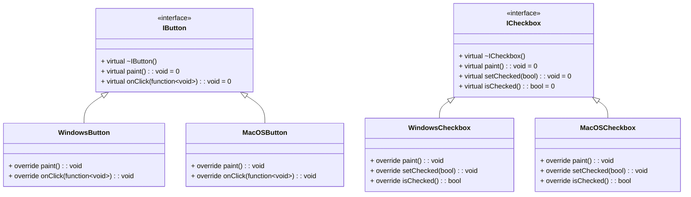
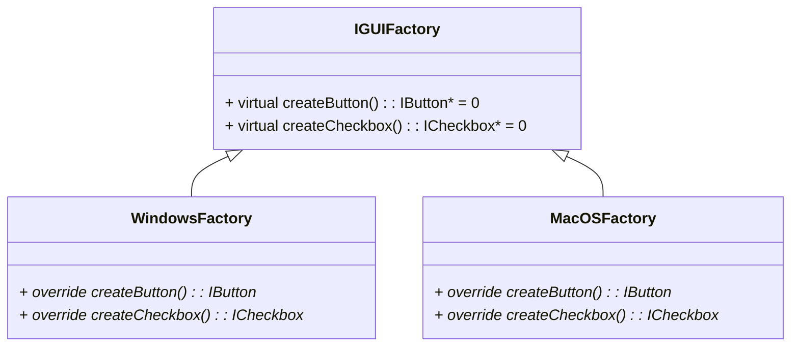

```mermaid
classDiagram
    class IButton {
        <<interface>>
        + virtual ~IButton()
        + virtual paint(): void = 0
        + virtual onClick(function~void~): void = 0
    }

    class ICheckbox {
        <<interface>>
        + virtual ~ICheckbox()
        + virtual paint(): void = 0
        + virtual setChecked(bool): void = 0
        + virtual isChecked(): bool = 0
    }

    class WindowsButton {
        + override paint(): void
        + override onClick(function~void~): void
    }

    class WindowsCheckbox {
        + override paint(): void
        + override setChecked(bool): void
        + override isChecked(): bool
    }

    class MacOSButton {
        + override paint(): void
        + override onClick(function~void~): void
    }

    class MacOSCheckbox {
        + override paint(): void
        + override setChecked(bool): void
        + override isChecked(): bool
    }

    IButton <|-- WindowsButton
    IButton <|-- MacOSButton

    ICheckbox <|-- WindowsCheckbox
    ICheckbox <|-- MacOSCheckbox
```

```mermaid
classDiagram
    class IGUIFactory {
        + virtual createButton(): IButton* = 0
        + virtual createCheckbox(): ICheckbox* = 0
    }

    class WindowsFactory {
        + override createButton(): IButton*
        + override createCheckbox(): ICheckbox*
    }

    class MacOSFactory {
        + override createButton(): IButton*
        + override createCheckbox(): ICheckbox*
    }

    IGUIFactory <|-- WindowsFactory
    IGUIFactory <|-- MacOSFactory
```