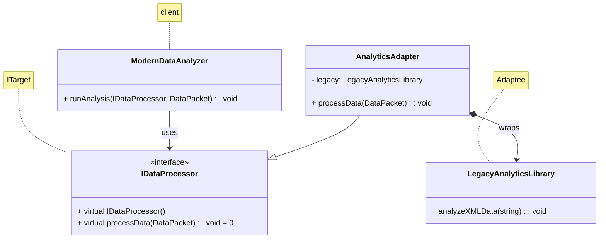

```mermaid
classDiagram
    class IDataProcessor {
        <<interface>>
        + virtual IDataProcessor()
        + virtual processData(DataPacket): void = 0
    }
    note for IDataProcessor "ITarget"

    class LegacyAnalyticsLibrary {
        + analyzeXMLData(string) : void
    }
    note for LegacyAnalyticsLibrary "Adaptee"

    class ModernDataAnalyzer {
        + runAnalysis(IDataProcessor, DataPacket): void
    }
    note for ModernDataAnalyzer "client"

    class AnalyticsAdapter {
        - legacy: LegacyAnalyticsLibrary
        + processData(DataPacket): void
    }

    ModernDataAnalyzer --> IDataProcessor: uses
    AnalyticsAdapter --|> IDataProcessor
    AnalyticsAdapter *--> LegacyAnalyticsLibrary: wraps
```