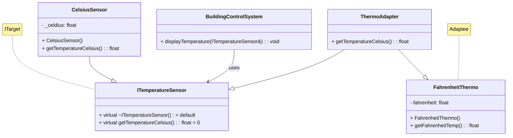

```mermaid
classDiagram
    class ITemperatureSensor {
        + virtual ~ITemperatureSensor() = default
        + virtual getTemperatureCelsius(): float = 0
    }
    note for ITemperatureSensor "ITarget"

    class CelsiusSensor {
        - _celdius: float
        + CelsiusSensor()
        + getTemperatureCelsius() : float
    }

    class BuildingControlSystem {
        + displayTemperature(ITemperatureSensor&): void
    }

    class FahrenheitThermo {
        - fahrenheit: float
        + FahrenheitThermo()
        + getFahrenheitTemp() : float
    }
    note for FahrenheitThermo "Adaptee"

    class ThermoAdapter {
        + getTemperatureCelsius(): float
    }

    CelsiusSensor --|> ITemperatureSensor
    ThermoAdapter --|> ITemperatureSensor
    ThermoAdapter --|> FahrenheitThermo

    BuildingControlSystem --> ITemperatureSensor: uses
```