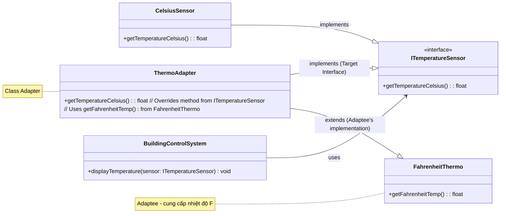

### Bài tập: Hệ thống Quản lý Nhiệt độ Tòa nhà

**Bối cảnh:**
Bạn đang xây dựng một hệ thống quản lý nhiệt độ cho một tòa nhà thông minh. Hệ thống cần đọc nhiệt độ từ các cảm biến khác nhau.

**Câu a: Cài đặt ban đầu với cảm biến Celsius**

1.  **Định nghĩa Cảm biến Celsius (`CelsiusSensor`):**
    *   Tạo một lớp `CelsiusSensor`.
    *   Lớp này có một phương thức `float getTemperatureCelsius()` trả về nhiệt độ hiện tại theo độ C (bạn có thể giả lập giá trị này, ví dụ: luôn trả về 25.0f hoặc một giá trị ngẫu nhiên nhỏ).

2.  **Định nghĩa Hệ thống Điều khiển (`BuildingControlSystem`):**
    *   Tạo một lớp `BuildingControlSystem`.
    *   Lớp này có một phương thức `void displayTemperature(CelsiusSensor& sensor)` nhận vào một tham chiếu đến `CelsiusSensor`.
    *   Bên trong `displayTemperature`, gọi `sensor.getTemperatureCelsius()` và in ra màn hình nhiệt độ dưới dạng "Current temperature: XX.X C".

3.  **Viết `main()`:**
    *   Tạo một đối tượng `CelsiusSensor`.
    *   Tạo một đối tượng `BuildingControlSystem`.
    *   Gọi phương thức `displayTemperature` của hệ thống điều khiển, truyền cảm biến Celsius vào.

**Câu b: Tích hợp Cảm biến Fahrenheit sử dụng Class Adapter**

**Vấn đề:** Tòa nhà vừa lắp đặt thêm một loại cảm biến nhiệt độ mới từ một nhà cung cấp khác. Cảm biến này (`FahrenheitThermo`) cung cấp nhiệt độ theo độ F và có giao diện khác:

```cpp
// Cảm biến mới (Adaptee) - bạn không thể sửa đổi lớp này
class FahrenheitThermo {
public:
    float getFahrenheitTemp() {
        // Giả lập giá trị, ví dụ: luôn trả về 77.0f
        return 77.0f;
    }
};
```

Hệ thống `BuildingControlSystem` hiện tại của bạn chỉ được thiết kế để làm việc với `CelsiusSensor` (hoặc một interface chung nếu bạn đã nghĩ trước, nhưng trong câu a, chúng ta giả định nó làm việc trực tiếp với `CelsiusSensor`). Bạn cần tích hợp `FahrenheitThermo` vào hệ thống mà **không sửa đổi `BuildingControlSystem`** (hoặc chỉ sửa đổi rất ít để nó chấp nhận một interface chung hơn).

**Yêu cầu:**

1.  **(Tùy chọn nhưng khuyến khích) Tái cấu trúc `BuildingControlSystem` (Nếu cần):**
    *   Nếu trong câu a, `BuildingControlSystem::displayTemperature` nhận trực tiếp `CelsiusSensor&`, hãy xem xét việc tạo một interface `ITemperatureSensor` với phương thức `virtual float getTemperatureCelsius() = 0;`.
    *   Làm cho `CelsiusSensor` triển khai `ITemperatureSensor`.
    *   Thay đổi `BuildingControlSystem::displayTemperature` để nhận `ITemperatureSensor&`.
    *   *Mục đích của bước này là để Client (BuildingControlSystem) làm việc với một Target Interface, điều kiện tiên quyết để Adapter hoạt động hiệu quả.*

2.  **Thiết kế Class Adapter (`ThermoAdapter`):**
    *   Tạo một lớp `ThermoAdapter` sử dụng **đa kế thừa**.
    *   `ThermoAdapter` sẽ kế thừa từ:
        *   `CelsiusSensor` (nếu bạn không làm bước tùy chọn trên và `BuildingControlSystem` vẫn mong đợi `CelsiusSensor`). **HOẶC**
        *   `ITemperatureSensor` (nếu bạn đã tạo interface này ở bước tùy chọn).
        *   VÀ `FahrenheitThermo` (để kế thừa phương thức `getFahrenheitTemp()`).
    *   Bên trong `ThermoAdapter`, **ghi đè (override)** phương thức `getTemperatureCelsius()`.
    *   Trong phương thức `getTemperatureCelsius()` được ghi đè:
        *   Gọi `this->getFahrenheitTemp()` (được kế thừa từ `FahrenheitThermo`) để lấy nhiệt độ độ F.
        *   **Chuyển đổi** nhiệt độ từ độ F sang độ C. Công thức: `C = (F - 32) * 5.0 / 9.0`.
        *   Trả về giá trị độ C đã chuyển đổi.

3.  **Cập nhật `main()`:**
    *   Tạo một đối tượng `ThermoAdapter`.
    *   Sử dụng đối tượng `BuildingControlSystem` hiện có.
    *   Gọi phương thức `displayTemperature` của hệ thống điều khiển, truyền đối tượng `ThermoAdapter` vào. Hệ thống điều khiển sẽ nghĩ rằng nó đang làm việc với một `CelsiusSensor` (hoặc `ITemperatureSensor`) nhưng thực chất, dữ liệu nhiệt độ đến từ `FahrenheitThermo` thông qua Adapter.

**Sơ đồ lớp cho Câu b (sử dụng Class Adapter và ITemperatureSensor):**



**Mã nguồn khởi đầu (bạn cần hoàn thiện từng câu):**

**Câu a:**
```cpp
#include <iostream>
#include <string>
#include <iomanip> // For std::fixed and std::setprecision

// --- Cảm biến Celsius ---
class CelsiusSensor {
public:
    virtual ~CelsiusSensor() = default; // Thêm virtual destructor nếu có kế hoạch kế thừa
    // Nếu muốn BuildingControlSystem làm việc với interface ở câu b,
    // thì phương thức này nên là virtual.
    virtual float getTemperatureCelsius() {
        // Giả lập giá trị
        return 25.0f;
    }
};

// --- Hệ thống Điều khiển ---
class BuildingControlSystem {
public:
    // Ban đầu, có thể làm việc trực tiếp với CelsiusSensor
    // Hoặc tốt hơn là làm việc với một interface (ITemperatureSensor) ngay từ đầu
    void displayTemperature(CelsiusSensor& sensor) { // Hoặc ITemperatureSensor& sensor
        float tempC = sensor.getTemperatureCelsius();
        std::cout << std::fixed << std::setprecision(1);
        std::cout << "Current temperature: " << tempC << " C" << std::endl;
    }
};

// int main_a() { // Đổi tên main để tránh trùng lặp khi làm câu b
//     std::cout << "--- Câu a: Hệ thống ban đầu ---" << std::endl;
//     CelsiusSensor sensorA;
//     BuildingControlSystem controlSystemA;
//     controlSystemA.displayTemperature(sensorA);
//     return 0;
// }
```

**Câu b:**
```cpp
#include <iostream>
#include <string>
#include <iomanip> // For std::fixed and std::setprecision

// --- (TÙY CHỌN) Target Interface ---
class ITemperatureSensor {
public:
    virtual ~ITemperatureSensor() = default;
    virtual float getTemperatureCelsius() = 0;
};

// --- Cảm biến Celsius (có thể kế thừa từ ITemperatureSensor) ---
class CelsiusSensor : public ITemperatureSensor { // Nếu dùng interface
public:
    float getTemperatureCelsius() override { // override nếu kế thừa
        return 25.0f;
    }
};

// --- Adaptee: Cảm biến Fahrenheit ---
class FahrenheitThermo {
public:
    virtual ~FahrenheitThermo() = default; // Thêm virtual destructor cho an toàn
    // Phương thức này có thể là virtual nếu ThermoAdapter cần override nó,
    // nhưng trong Class Adapter, chúng ta thường kế thừa trực tiếp implementation.
    float getFahrenheitTemp() {
        return 77.0f; //  ~25 C
    }
};

// --- Class Adapter: ThermoAdapter (CẦN BẠN HOÀN THIỆN) ---
// ThermoAdapter kế thừa từ ITemperatureSensor (Target)
// và FahrenheitThermo (Adaptee)
class ThermoAdapter : public ITemperatureSensor, public FahrenheitThermo {
public:
    // TODO: Ghi đè phương thức getTemperatureCelsius()
    // Bên trong, gọi getFahrenheitTemp() và chuyển đổi sang Celsius
    float getTemperatureCelsius() override {
        float tempF = this->getFahrenheitTemp(); // Gọi phương thức từ FahrenheitThermo
        float tempC = (tempF - 32.0f) * 5.0f / 9.0f;
        std::cout << "(Adapter: Converting " << tempF << "F to " << tempC << "C)" << std::endl;
        return tempC;
    }
};


// --- Hệ thống Điều khiển (Nên làm việc với ITemperatureSensor) ---
class BuildingControlSystem {
public:
    void displayTemperature(ITemperatureSensor& sensor) {
        float tempC = sensor.getTemperatureCelsius();
        std::cout << std::fixed << std::setprecision(1);
        std::cout << "BuildingControlSystem: Current temperature: " << tempC << " C" << std::endl;
    }
};

// int main() { // Đây sẽ là main cho cả câu a và b sau khi hoàn thành
//     std::cout << "--- Câu a: Hệ thống ban đầu (sử dụng ITemperatureSensor) ---" << std::endl;
//     CelsiusSensor sensorA;
//     BuildingControlSystem controlSystem; // Chỉ cần 1 control system
//     controlSystem.displayTemperature(sensorA);

//     std::cout << "\n--- Câu b: Tích hợp cảm biến Fahrenheit ---" << std::endl;
//     ThermoAdapter fahrenheitAdapter;
//     controlSystem.displayTemperature(fahrenheitAdapter);

//     return 0;
// }
```

**Mục tiêu của bài tập:**
*   Hiểu cách Class Adapter sử dụng đa kế thừa để đạt được mục tiêu.
*   Thực hành việc ghi đè phương thức và chuyển đổi dữ liệu/lời gọi bên trong Adapter.
*   Thấy được cách Client có thể làm việc với Adaptee (thông qua Adapter) mà không cần biết về sự tồn tại của Adaptee.
*   Nhận ra sự cần thiết của một Target Interface để Client có thể tương tác một cách linh hoạt.