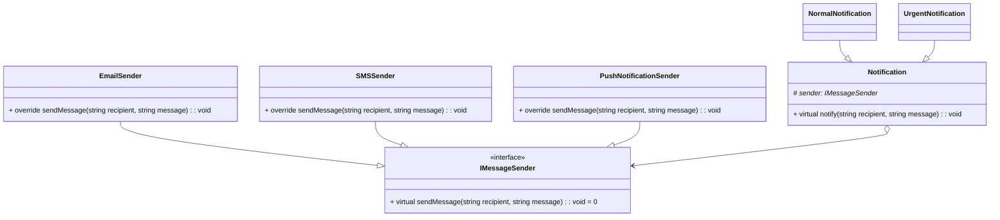

```mermaid
classDiagram
    class IMessageSender {
        <<interface>>
        + virtual sendMessage(string recipient, string message): void = 0
    }

    class EmailSender {
        + override sendMessage(string recipient, string message): void
    }

    class SMSSender {
        + override sendMessage(string recipient, string message): void
    }

    class PushNotificationSender {
        + override sendMessage(string recipient, string message): void
    }

    EmailSender --|> IMessageSender
    SMSSender --|> IMessageSender
    PushNotificationSender --|> IMessageSender

    class Notification {
        # sender: IMessageSender*
        + virtual notify(string recipient, string message): void
    }

    class NormalNotification {

    }

    class UrgentNotification {

    }

    NormalNotification --|> Notification
    UrgentNotification --|> Notification

    Notification o--> IMessageSender
```