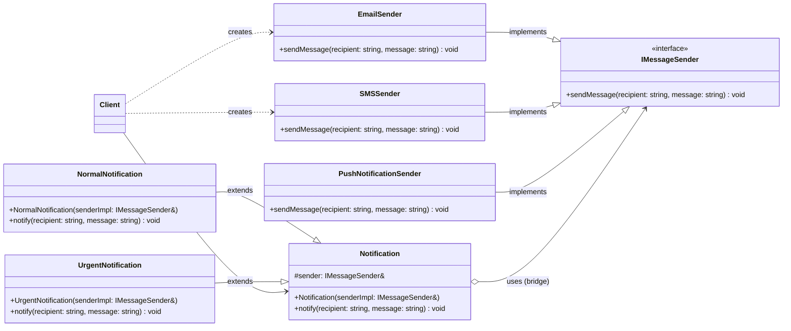

### Bài tập: Hệ thống Thông báo Đa Kênh

**Bối cảnh:**
Bạn đang xây dựng một hệ thống có khả năng gửi thông báo cho người dùng. Các thông báo này có thể có các mức độ ưu tiên khác nhau (ví dụ: Thông báo Thông thường, Thông báo Khẩn cấp) và có thể được gửi qua nhiều kênh khác nhau (ví dụ: Email, SMS, Push Notification trên ứng dụng).

Nếu không sử dụng Bridge, bạn có thể phải tạo các lớp như `EmailNormalNotification`, `EmailUrgentNotification`, `SMSNormalNotification`, `SMSUrgentNotification`, v.v., dẫn đến bùng nổ số lượng lớp.

**Yêu cầu:**
Sử dụng **Bridge Pattern** để thiết kế và triển khai một hệ thống thông báo linh hoạt, cho phép bạn dễ dàng thêm các loại thông báo mới hoặc các kênh gửi mới mà không cần sửa đổi nhiều code hiện có.

**Các thành phần cần xác định:**

1.  **Abstraction (Loại Thông báo):**
    *   `Notification` (Lớp cơ sở trừu tượng)
        *   Chứa một tham chiếu đến `IMessageSender` (Implementation).
        *   Có một phương thức `notify(std::string recipient, std::string message)`. Phương thức này sẽ sử dụng `IMessageSender` để gửi thông điệp.
    *   `NormalNotification` (Refined Abstraction): Kế thừa từ `Notification`. Có thể có logic tiền xử lý/hậu xử lý riêng cho thông báo thường.
    *   `UrgentNotification` (Refined Abstraction): Kế thừa từ `Notification`. Có thể có logic riêng, ví dụ như thêm tiền tố "[URGENT]" vào tin nhắn trước khi gửi.

2.  **Implementation (Kênh Gửi Tin):**
    *   `IMessageSender` (Interface của Implementation)
        *   Khai báo một phương thức `sendMessage(std::string recipient, std::string message)`.
    *   `EmailSender` (Concrete Implementation): Triển khai `IMessageSender` để gửi thông báo qua email (chỉ cần in ra console mô phỏng).
    *   `SMSSender` (Concrete Implementation): Triển khai `IMessageSender` để gửi thông báo qua SMS (chỉ cần in ra console mô phỏng).
    *   `PushNotificationSender` (Concrete Implementation): Triển khai `IMessageSender` để gửi qua push notification (chỉ cần in ra console mô phỏng).

**Các bước thực hiện:**

1.  **Định nghĩa Implementation Interface (`IMessageSender`) và các Concrete Implementations (`EmailSender`, `SMSSender`, `PushNotificationSender`):**
    *   `IMessageSender` có phương thức `virtual void sendMessage(const std::string& recipient, const std::string& message) = 0;`.
    *   Các lớp cụ thể sẽ override `sendMessage` và in ra thông báo tương ứng với kênh của chúng (ví dụ: "Email sent to [recipient]: [message]").

2.  **Định nghĩa Abstraction (`Notification`) và các Refined Abstractions (`NormalNotification`, `UrgentNotification`):**
    *   Lớp `Notification` sẽ có một constructor nhận vào một `IMessageSender&` (hoặc `std::shared_ptr<IMessageSender>`) và lưu trữ nó.
    *   Phương thức `virtual void notify(const std::string& recipient, const std::string& message)` của `Notification` sẽ gọi `m_sender->sendMessage(recipient, processed_message)`.
    *   `NormalNotification` có thể chỉ gọi thẳng phương thức `notify` của lớp cha hoặc có một chút logic đơn giản.
    *   `UrgentNotification` trong phương thức `notify` của nó, sẽ sửa đổi `message` (ví dụ: thêm "[URGENT] ") trước khi gọi `m_sender->sendMessage(...)`.

3.  **Viết Client Code (ví dụ trong `main()`):**
    *   Tạo các đối tượng `IMessageSender` khác nhau (ví dụ: `EmailSender`, `SMSSender`).
    *   Tạo các đối tượng `Notification` khác nhau (ví dụ: `NormalNotification`, `UrgentNotification`), và khi tạo, **truyền (inject)** đối tượng `IMessageSender` tương ứng vào constructor của chúng.
    *   Gọi phương thức `notify` trên các đối tượng `Notification` khác nhau để xem chúng hoạt động như thế nào với các kênh gửi khác nhau.

**Sơ đồ lớp (Mermaid):**
Bạn hãy tự vẽ sơ đồ lớp bằng Mermaid dựa trên mô tả này. Nó sẽ giúp bạn hình dung rõ ràng hơn cấu trúc của pattern.



**Mã nguồn khởi đầu (bạn cần hoàn thiện):**

```cpp
#include <iostream>
#include <string>
#include <memory> // For std::shared_ptr if you choose to use it

// --- Implementation Interface and Concrete Implementations ---
class IMessageSender {
public:
    virtual ~IMessageSender() = default;
    virtual void sendMessage(const std::string& recipient, const std::string& message) = 0;
};

class EmailSender : public IMessageSender {
public:
    void sendMessage(const std::string& recipient, const std::string& message) override {
        std::cout << "Sending EMAIL to '" << recipient << "': \"" << message << "\"" << std::endl;
    }
};

class SMSSender : public IMessageSender {
public:
    void sendMessage(const std::string& recipient, const std::string& message) override {
        std::cout << "Sending SMS to '" << recipient << "': \"" << message << "\"" << std::endl;
    }
};

class PushNotificationSender : public IMessageSender {
public:
     void sendMessage(const std::string& recipient, const std::string& message) override {
        std::cout << "Sending PUSH NOTIFICATION to '" << recipient << "': \"" << message << "\"" << std::endl;
    }
};


// --- Abstraction and Refined Abstractions (CẦN BẠN HOÀN THIỆN) ---
class Notification {
protected:
    IMessageSender& m_sender; // Hoặc std::shared_ptr<IMessageSender> m_sender;

public:
    Notification(IMessageSender& sender) : m_sender(sender) {}
    // Nếu dùng shared_ptr:
    // Notification(std::shared_ptr<IMessageSender> sender) : m_sender(sender) {}

    virtual ~Notification() = default;

    // Phương thức này có thể là non-virtual nếu logic chính nằm ở đây
    // và các lớp con chỉ override nếu cần tiền/hậu xử lý đặc biệt.
    // Hoặc nó có thể là virtual thuần túy nếu lớp con phải định nghĩa hoàn toàn.
    // Trong trường hợp này, chúng ta để nó là virtual để lớp con có thể tùy chỉnh.
    virtual void send(const std::string& recipient, const std::string& message) {
        std::cout << "Notification: Preparing to send message." << std::endl;
        m_sender.sendMessage(recipient, message);
        // Hoặc: if (m_sender) m_sender->sendMessage(recipient, message); nếu dùng smart pointer
    }
};

class NormalNotification : public Notification {
public:
    NormalNotification(IMessageSender& sender) : Notification(sender) {}
    // Nếu dùng shared_ptr:
    // NormalNotification(std::shared_ptr<IMessageSender> sender) : Notification(sender) {}

    void send(const std::string& recipient, const std::string& message) override {
        std::cout << "NormalNotification: Processing normal message." << std::endl;
        // Gọi lại phương thức của lớp cha, hoặc trực tiếp m_sender.sendMessage
        Notification::send(recipient, message); // Hoặc: m_sender.sendMessage(recipient, message);
    }
};

class UrgentNotification : public Notification {
public:
    UrgentNotification(IMessageSender& sender) : Notification(sender) {}
    // Nếu dùng shared_ptr:
    // UrgentNotification(std::shared_ptr<IMessageSender> sender) : Notification(sender) {}

    void send(const std::string& recipient, const std::string& message) override {
        std::cout << "UrgentNotification: Processing urgent message." << std::endl;
        std::string urgentMessage = "[URGENT!!!] " + message + " [!!!URGENT]";
        // Gọi lại phương thức của lớp cha với message đã xử lý, hoặc trực tiếp m_sender.sendMessage
        Notification::send(recipient, urgentMessage); // Hoặc: m_sender.sendMessage(recipient, urgentMessage);
    }
};


int main() {
    // Tạo các Senders (Implementations)
    EmailSender emailSender;
    SMSSender smsSender;
    PushNotificationSender pushSender;

    // Sử dụng tham chiếu
    std::cout << "--- Using Email Sender ---" << std::endl;
    NormalNotification normalEmail(emailSender);
    normalEmail.send("john.doe@example.com", "Your weekly report is ready.");

    UrgentNotification urgentEmail(emailSender);
    urgentEmail.send("jane.doe@example.com", "System critical alert! Please check immediately.");

    std::cout << "\n--- Using SMS Sender ---" << std::endl;
    NormalNotification normalSms(smsSender);
    normalSms.send("+1234567890", "Friendly reminder: Appointment tomorrow.");

    UrgentNotification urgentSms(smsSender);
    urgentSms.send("+0987654321", "Security breach detected on your account.");

    std::cout << "\n--- Using Push Notification Sender ---" << std::endl;
    // Tạo một NormalNotification sử dụng PushNotificationSender
    NormalNotification normalPush(pushSender);
    normalPush.send("user_device_token_123", "You have a new follower!");

    // Tạo một UrgentNotification sử dụng PushNotificationSender
    UrgentNotification urgentPush(pushSender);
    urgentPush.send("admin_device_token_xyz", "Server overload! Action required.");


    // Nếu bạn chọn dùng std::shared_ptr cho sender trong Notification:
    // std::shared_ptr<IMessageSender> emailSenderPtr = std::make_shared<EmailSender>();
    // std::shared_ptr<IMessageSender> smsSenderPtr = std::make_shared<SMSSender>();

    // std::cout << "\n--- Using Shared_ptr with Email Sender ---" << std::endl;
    // NormalNotification normalEmailShared(emailSenderPtr);
    // normalEmailShared.send("shared.user@example.com", "This is via shared_ptr.");

    // UrgentNotification urgentSmsShared(smsSenderPtr);
    // urgentSmsShared.send("shared.sms.user", "Urgent via shared_ptr to SMS.");


    return 0;
}
```

**Mục tiêu của bài tập:**
*   Hiểu rõ cách Bridge tách rời hai hệ thống phân cấp: loại thông báo (Abstraction) và kênh gửi (Implementation).
*   Thực hành việc truyền (inject) Implementation vào Abstraction.
*   Thấy được sự linh hoạt khi có thể kết hợp bất kỳ Refined Abstraction nào với bất kỳ Concrete Implementation nào.
*   Nhận ra rằng việc thêm một loại thông báo mới (ví dụ: `PromotionalNotification`) hoặc một kênh gửi mới (ví dụ: `SlackSender`) chỉ yêu cầu tạo lớp mới trong một hệ thống phân cấp mà không ảnh hưởng nhiều đến hệ thống phân cấp còn lại.