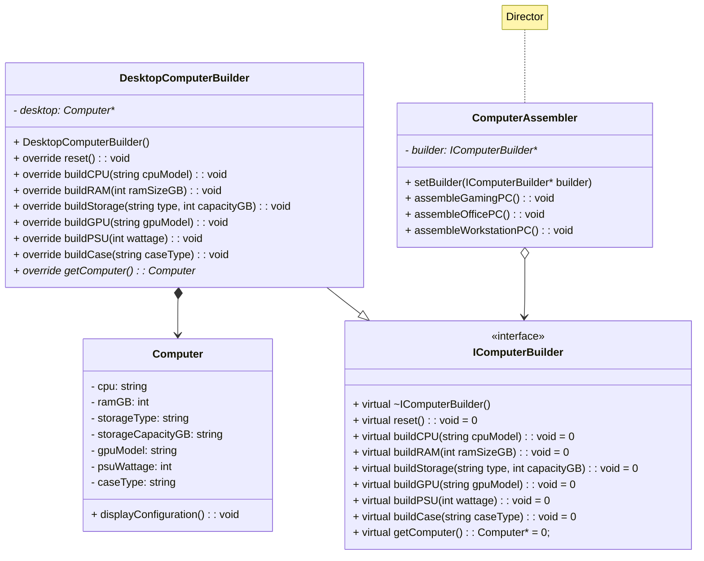

```mermaid
classDiagram
    class Computer {
        - cpu: string
        - ramGB: int
        - storageType: string
        - storageCapacityGB: string
        - gpuModel: string
        - psuWattage: int
        - caseType: string
        + displayConfiguration(): void
    }

    class IComputerBuilder {
        <<interface>>
        + virtual ~IComputerBuilder()
        + virtual reset(): void = 0
        + virtual buildCPU(string cpuModel): void = 0
        + virtual buildRAM(int ramSizeGB): void = 0
        + virtual buildStorage(string type, int capacityGB): void = 0
        + virtual buildGPU(string gpuModel): void = 0
        + virtual buildPSU(int wattage): void = 0
        + virtual buildCase(string caseType): void = 0
        + virtual getComputer(): Computer* = 0;
    }

    class DesktopComputerBuilder {
        - desktop: Computer**
        + DesktopComputerBuilder()
        + override reset(): void
        + override buildCPU(string cpuModel): void
        + override buildRAM(int ramSizeGB): void
        + override buildStorage(string type, int capacityGB): void
        + override buildGPU(string gpuModel): void
        + override buildPSU(int wattage): void
        + override buildCase(string caseType): void
        + override getComputer(): Computer*
    }

    DesktopComputerBuilder --|> IComputerBuilder
    DesktopComputerBuilder *--> Computer

    class ComputerAssembler {
        - builder: IComputerBuilder**
        + setBuilder(IComputerBuilder* builder)
        + assembleGamingPC(): void
        + assembleOfficePC(): void
        + assembleWorkstationPC(): void
    }
    note for ComputerAssembler "Director"

    ComputerAssembler o--> IComputerBuilder
```