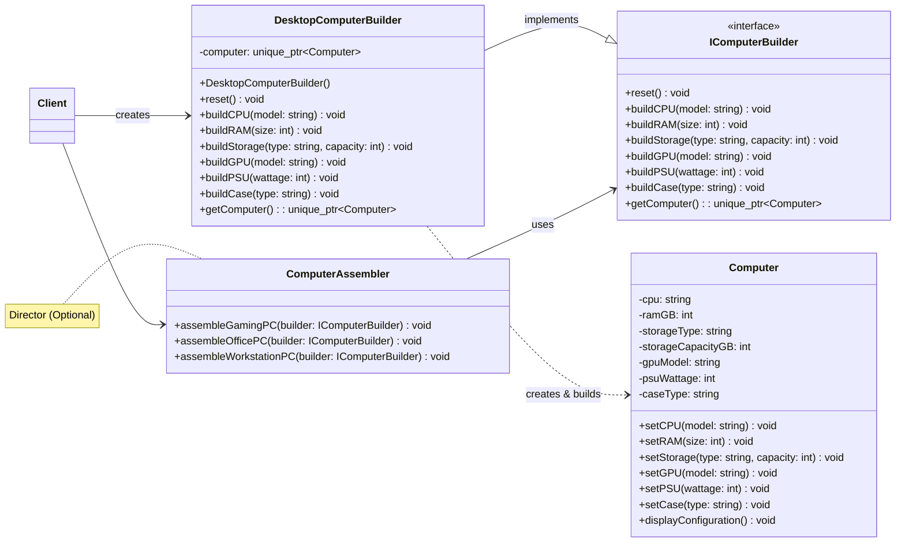

### Bài tập: Xây dựng Cấu hình Máy tính (Computer Configuration Builder)

**Bối cảnh:**
Bạn đang làm việc cho một công ty bán máy tính tùy chỉnh. Khách hàng có thể chọn lựa nhiều thành phần khác nhau để xây dựng chiếc máy tính mơ ước của họ: CPU, RAM, Ổ cứng (Storage), Card đồ họa (GPU), Nguồn (PSU), và Vỏ máy (Case).

Việc tạo một đối tượng `Computer` với tất cả các tùy chọn này thông qua một constructor duy nhất sẽ rất cồng kềnh (telescoping constructor). Sử dụng nhiều lớp con cho mỗi cấu hình cũng không khả thi.

**Yêu cầu:**
Sử dụng **Builder Pattern** để thiết kế và triển khai một hệ thống cho phép xây dựng các đối tượng `Computer` một cách linh hoạt, từng bước một.

**Các thành phần cần xác định:**

1.  **Product (`Computer`):**
    *   Lớp `Computer` sẽ lưu trữ thông tin về các thành phần của nó:
        *   `std::string cpu;`
        *   `int ramGB;`
        *   `std::string storageType; // "SSD" hoặc "HDD"`
        *   `int storageCapacityGB;`
        *   `std::string gpuModel;`
        *   `int psuWattage;`
        *   `std::string caseType; // "MidTower", "FullTower", "MiniITX"`
    *   Có một phương thức `void displayConfiguration() const;` để in ra thông tin cấu hình máy tính.

2.  **Builder Interface (`IComputerBuilder`):**
    *   Định nghĩa một interface `IComputerBuilder` với các phương thức để thiết lập từng thành phần của máy tính:
        *   `virtual void reset() = 0;`
        *   `virtual void buildCPU(const std::string& cpuModel) = 0;`
        *   `virtual void buildRAM(int ramSizeGB) = 0;`
        *   `virtual void buildStorage(const std::string& type, int capacityGB) = 0;`
        *   `virtual void buildGPU(const std::string& gpuModel) = 0;`
        *   `virtual void buildPSU(int wattage) = 0;`
        *   `virtual void buildCase(const std::string& caseType) = 0;`
        *   `virtual std::unique_ptr<Computer> getComputer() = 0;` (Để lấy sản phẩm cuối cùng)

3.  **Concrete Builder (`DesktopComputerBuilder`):**
    *   Tạo một lớp `DesktopComputerBuilder` triển khai `IComputerBuilder`.
    *   Lớp này sẽ quản lý một đối tượng `Computer` đang được xây dựng.
    *   Mỗi phương thức `build...()` sẽ thiết lập thuộc tính tương ứng cho đối tượng `Computer` bên trong.
    *   Phương thức `reset()` sẽ tạo một đối tượng `Computer` mới.
    *   Phương thức `getComputer()` sẽ trả về đối tượng `Computer` đã hoàn thành và reset builder để sẵn sàng cho lần xây dựng tiếp theo.

4.  **Director (Tùy chọn nhưng khuyến khích - `ComputerAssembler`):**
    *   Tạo một lớp `ComputerAssembler` (Director).
    *   Lớp này sẽ có các phương thức để xây dựng các cấu hình máy tính phổ biến, ví dụ:
        *   `void assembleGamingPC(IComputerBuilder& builder);`
        *   `void assembleOfficePC(IComputerBuilder& builder);`
        *   `void assembleWorkstationPC(IComputerBuilder& builder);`
    *   Các phương thức này sẽ gọi các bước `build...()` trên đối tượng `IComputerBuilder` được truyền vào theo một thứ tự và với các thông số cụ thể.

5.  **Client Code (trong `main()`):**
    *   **Cách 1 (Sử dụng Director):**
        *   Tạo một đối tượng `DesktopComputerBuilder`.
        *   Tạo một đối tượng `ComputerAssembler`.
        *   Sử dụng `ComputerAssembler` để xây dựng một "Gaming PC" bằng cách truyền `DesktopComputerBuilder` vào.
        *   Lấy đối tượng `Computer` từ `DesktopComputerBuilder` và hiển thị cấu hình của nó.
        *   Làm tương tự để xây dựng một "Office PC".
    *   **Cách 2 (Client điều khiển Builder trực tiếp):**
        *   Tạo một đối tượng `DesktopComputerBuilder`.
        *   Client tự gọi các phương thức `build...()` trên builder để tạo một cấu hình máy tính tùy chỉnh (ví dụ: một máy tính không có GPU rời, hoặc có dung lượng RAM rất lớn).
        *   Lấy đối tượng `Computer` từ builder và hiển thị cấu hình.

**Sơ đồ lớp (Mermaid):**
Bạn hãy tự vẽ sơ đồ lớp bằng Mermaid dựa trên mô tả này. Nó sẽ giúp bạn hình dung rõ ràng hơn cấu trúc của pattern.



**Mã nguồn khởi đầu (bạn cần hoàn thiện):**

```cpp
#include <iostream>
#include <string>
#include <vector>
#include <memory> // For std::unique_ptr

// --- Product ---
class Computer {
public:
    std::string cpu;
    int ramGB = 0;
    std::string storageType;
    int storageCapacityGB = 0;
    std::string gpuModel; // Có thể trống nếu là onboard GPU
    int psuWattage = 0;
    std::string caseType;

    void displayConfiguration() const {
        std::cout << "--- Computer Configuration ---" << std::endl;
        if (!cpu.empty()) std::cout << "CPU: " << cpu << std::endl;
        if (ramGB > 0) std::cout << "RAM: " << ramGB << "GB" << std::endl;
        if (!storageType.empty()) std::cout << "Storage: " << storageCapacityGB << "GB " << storageType << std::endl;
        if (!gpuModel.empty()) std::cout << "GPU: " << gpuModel << std::endl;
        else std::cout << "GPU: Integrated Graphics" << std::endl;
        if (psuWattage > 0) std::cout << "PSU: " << psuWattage << "W" << std::endl;
        if (!caseType.empty()) std::cout << "Case: " << caseType << std::endl;
        std::cout << "----------------------------" << std::endl;
    }
};

// --- Builder Interface (CẦN BẠN HOÀN THIỆN) ---
class IComputerBuilder {
public:
    virtual ~IComputerBuilder() = default;
    virtual void reset() = 0;
    virtual void buildCPU(const std::string& cpuModel) = 0;
    virtual void buildRAM(int ramSizeGB) = 0;
    virtual void buildStorage(const std::string& type, int capacityGB) = 0;
    virtual void buildGPU(const std::string& gpuModel) = 0;
    virtual void buildPSU(int wattage) = 0;
    virtual void buildCase(const std::string& caseType) = 0;
    virtual std::unique_ptr<Computer> getComputer() = 0;
};

// --- Concrete Builder (CẦN BẠN HOÀN THIỆN) ---
class DesktopComputerBuilder : public IComputerBuilder {
private:
    std::unique_ptr<Computer> m_computer;

public:
    DesktopComputerBuilder() {
        this->reset();
    }

    void reset() override {
        m_computer = std::make_unique<Computer>();
    }

    void buildCPU(const std::string& cpuModel) override {
        if(m_computer) m_computer->cpu = cpuModel;
    }

    void buildRAM(int ramSizeGB) override {
        if(m_computer) m_computer->ramGB = ramSizeGB;
    }

    void buildStorage(const std::string& type, int capacityGB) override {
        if(m_computer) {
            m_computer->storageType = type;
            m_computer->storageCapacityGB = capacityGB;
        }
    }

    void buildGPU(const std::string& gpuModel) override {
        if(m_computer) m_computer->gpuModel = gpuModel;
    }

    void buildPSU(int wattage) override {
        if(m_computer) m_computer->psuWattage = wattage;
    }

    void buildCase(const std::string& caseType) override {
        if(m_computer) m_computer->caseType = caseType;
    }

    std::unique_ptr<Computer> getComputer() override {
        std::unique_ptr<Computer> result = std::move(m_computer);
        this->reset(); // Sẵn sàng cho lần build tiếp theo
        return result;
    }
};

// --- Director (Optional - CẦN BẠN HOÀN THIỆN nếu muốn) ---
class ComputerAssembler {
public:
    void assembleGamingPC(IComputerBuilder& builder) {
        std::cout << "Director: Assembling a Gaming PC." << std::endl;
        builder.reset();
        builder.buildCPU("Intel Core i9 Extreme");
        builder.buildRAM(32); // 32GB RAM
        builder.buildStorage("SSD", 2048); // 2TB SSD
        builder.buildGPU("NVIDIA GeForce RTX 4090");
        builder.buildPSU(1000); // 1000W PSU
        builder.buildCase("Full Tower RGB");
    }

    void assembleOfficePC(IComputerBuilder& builder) {
        std::cout << "Director: Assembling an Office PC." << std::endl;
        builder.reset();
        builder.buildCPU("Intel Core i5");
        builder.buildRAM(16); // 16GB RAM
        builder.buildStorage("SSD", 512); // 512GB SSD
        // Không build GPU rời, sẽ dùng integrated
        builder.buildPSU(550); // 550W PSU
        builder.buildCase("Mid Tower Office");
    }

    void assembleWorkstationPC(IComputerBuilder& builder) {
        std::cout << "Director: Assembling a Workstation PC." << std::endl;
        builder.reset();
        builder.buildCPU("AMD Ryzen Threadripper Pro");
        builder.buildRAM(128);
        builder.buildStorage("NVMe SSD", 4096); // 4TB NVMe SSD
        builder.buildGPU("NVIDIA Quadro RTX A6000");
        builder.buildPSU(1200);
        builder.buildCase("Workstation Full Tower");
    }
};


int main() {
    DesktopComputerBuilder builder;
    ComputerAssembler director; // Optional

    // --- Cách 1: Sử dụng Director ---
    std::cout << "=== Building with Director ===" << std::endl;

    // Build Gaming PC
    director.assembleGamingPC(builder);
    std::unique_ptr<Computer> gamingPC = builder.getComputer();
    if (gamingPC) {
        std::cout << "Gaming PC Assembled by Director:" << std::endl;
        gamingPC->displayConfiguration();
    }

    // Build Office PC
    director.assembleOfficePC(builder);
    std::unique_ptr<Computer> officePC = builder.getComputer();
    if (officePC) {
        std::cout << "Office PC Assembled by Director:" << std::endl;
        officePC->displayConfiguration();
    }


    // --- Cách 2: Client điều khiển Builder trực tiếp ---
    std::cout << "\n=== Building Custom PC (Client-driven) ===" << std::endl;
    builder.reset(); // Đảm bảo builder sạch sẽ
    builder.buildCPU("AMD Ryzen 5 7600X");
    builder.buildRAM(32);
    builder.buildStorage("NVMe SSD", 1024);
    // Không gọi buildGPU() -> sẽ là integrated graphics
    builder.buildPSU(650);
    builder.buildCase("Mini ITX Compact");

    std::unique_ptr<Computer> customPC = builder.getComputer();
    if (customPC) {
        std::cout << "Custom PC Assembled by Client:" << std::endl;
        customPC->displayConfiguration();
    }

    // Xây dựng một máy tính siêu cơ bản
    std::cout << "\n=== Building Ultra Basic PC (Client-driven) ===" << std::endl;
    builder.reset();
    builder.buildCPU("Intel Celeron");
    builder.buildRAM(8);
    builder.buildStorage("HDD", 500);
    // Không GPU, PSU và Case sẽ là mặc định (hoặc client chọn)
    builder.buildPSU(400);
    builder.buildCase("Generic Micro ATX");

    std::unique_ptr<Computer> basicPC = builder.getComputer();
    if(basicPC) {
        std::cout << "Ultra Basic PC Assembled by Client:" << std::endl;
        basicPC->displayConfiguration();
    }

    return 0;
}
```

**Mục tiêu của bài tập:**
*   Hiểu rõ cách Builder Pattern giải quyết vấn đề "telescoping constructor" và "bùng nổ lớp con".
*   Thực hành việc tách biệt quá trình xây dựng đối tượng phức tạp (trong Builder) khỏi đối tượng đó (Product).
*   Thấy được sự linh hoạt khi Client có thể xây dựng đối tượng từng bước hoặc sử dụng Director để tạo các cấu hình được định sẵn.
*   Luyện tập cách sử dụng interface cho Builder để Director có thể làm việc với nhiều loại Builder khác nhau (mặc dù bài này chỉ có một Concrete Builder).