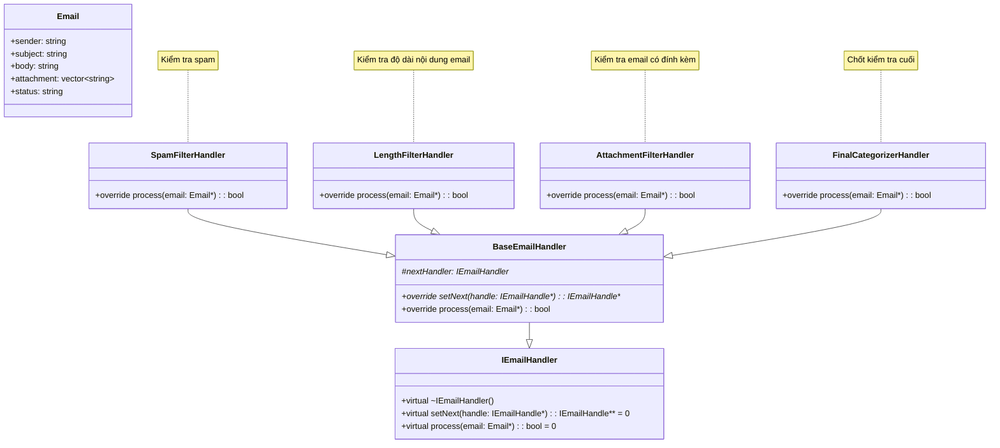

```mermaid
classDiagram
    class IEmailHandler {
        +virtual ~IEmailHandler()
        +virtual setNext(handle: IEmailHandle*): IEmailHandle** = 0
        +virtual process(email: Email*): bool = 0
    }

    BaseEmailHandler --|> IEmailHandler

    class BaseEmailHandler {
        #nextHandler: IEmailHandler*
        +override setNext(handle: IEmailHandle*): IEmailHandle**
        +override process(email: Email*): bool
    }

    SpamFilterHandler --|> BaseEmailHandler
    LengthFilterHandler --|> BaseEmailHandler
    AttachmentFilterHandler --|> BaseEmailHandler
    FinalCategorizerHandler --|> BaseEmailHandler

    class SpamFilterHandler {
        +override process(email: Email*): bool
    }
    note for SpamFilterHandler "Kiểm tra spam"

    class LengthFilterHandler {
        +override process(email: Email*): bool
    }
    note for LengthFilterHandler "Kiểm tra độ dài nội dung email"

    class AttachmentFilterHandler {
        +override process(email: Email*): bool
    }
    note for AttachmentFilterHandler "Kiểm tra email có đính kèm"

    class FinalCategorizerHandler {
        +override process(email: Email*): bool
    }
    note for FinalCategorizerHandler "Chốt kiểm tra cuối"

    class Email {
        +sender: string
        +subject: string
        +body: string
        +attachment: vector~string~
        +status: string
    }
```