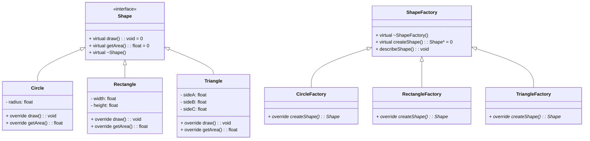

```mermaid
classDiagram
    class Shape {
        <<interface>>
        + virtual draw(): void = 0
        + virtual getArea(): float = 0
        + virtual ~Shape()
    }

    class Circle {
        - radius: float
        +  override draw(): void
        +  override getArea(): float
    }

    class Rectangle {
        - width: float
        - height: float
        +  override draw(): void
        +  override getArea(): float
    }

    class Triangle {
        - sideA: float
        - sideB: float
        - sideC: float
        +  override draw(): void
        +  override getArea(): float
    }

    Shape <|-- Circle
    Shape <|-- Rectangle
    Shape <|-- Triangle

    class ShapeFactory {
        + virtual ~ShapeFactory()
        + virtual createShape(): Shape* = 0
        + describeShape(): void
    }

    class CircleFactory {
        + override createShape(): Shape*
    }

    class RectangleFactory {
        + override createShape(): Shape*
    }

    class TriangleFactory {
        + override createShape(): Shape*
    }
    
    ShapeFactory <|-- CircleFactory
    ShapeFactory <|-- RectangleFactory
    ShapeFactory <|-- TriangleFactory
```