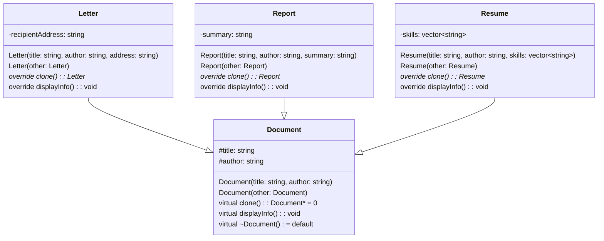

```mermaid
classDiagram
    class Document {
        #title: string
        #author: string
        Document(title: string, author: string)
        Document(other: Document)
        virtual clone(): Document* = 0
        virtual displayInfo(): void
        virtual ~Document() = default
    }

    class Letter {
        -recipientAddress: string
        Letter(title: string, author: string, address: string)
        Letter(other: Letter)
        override clone(): Letter*
        override displayInfo(): void
    }

    class Report {
        -summary: string
        Report(title: string, author: string, summary: string)
        Report(other: Report)
        override clone(): Report*
        override displayInfo(): void
    }

    class Resume {
        -skills: vector~string~
        Resume(title: string, author: string, skills: vector~string~)
        Resume(other: Resume)
        override clone(): Resume*
        override displayInfo(): void
    }

    Letter --|> Document
    Report --|> Document
    Resume --|> Document
```