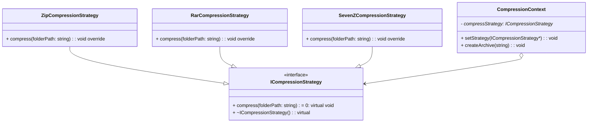

```mermaid
classDiagram
    class ICompressionStrategy {
        <<interface>>
        + compress(folderPath: string) = 0: virtual void
        + ~ICompressionStrategy(): virtual
    }
    
    class ZipCompressionStrategy {
        + compress(folderPath: string): void override
    }

    ZipCompressionStrategy --|> ICompressionStrategy

    class RarCompressionStrategy {
        + compress(folderPath: string): void override
    }

    RarCompressionStrategy --|> ICompressionStrategy

    class SevenZCompressionStrategy {
        + compress(folderPath: string): void override
    }

    SevenZCompressionStrategy --|> ICompressionStrategy

    class CompressionContext {
        - compressStrategy: ICompressionStrategy*
        + setStrategy(ICompressionStrategy*): void
        + createArchive(string): void
    }

    CompressionContext o--> ICompressionStrategy
```