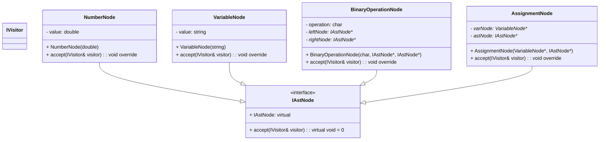

```mermaid
classDiagram
    class IVisitor {

    }

    class IAstNode {
        <<interface>>
        + IAstNode: virtual
        + accept(IVisitor& visitor): virtual void = 0
    }

    class NumberNode {
        - value: double
        + NumberNode(double)
        + accept(IVisitor& visitor): void override
    }

    NumberNode --|> IAstNode

    class VariableNode {
        - value: string
        + VariableNode(string)
        + accept(IVisitor& visitor): void override
    }

    VariableNode --|> IAstNode

    class BinaryOperationNode {
        - operation: char
        - leftNode: IAstNode**
        - rightNode: IAstNode**
        + BinaryOperationNode(char, IAstNode*, IAstNode*)
        + accept(IVisitor& visitor): void override
    }

    BinaryOperationNode --|> IAstNode
    
    class AssignmentNode {
        - varNode: VariableNode**
        - astNode: IAstNode**
        + AssignmentNode(VariableNode*, IAstNode*)
        + accept(IVisitor& visitor): void override
    }

    AssignmentNode --|> IAstNode

```