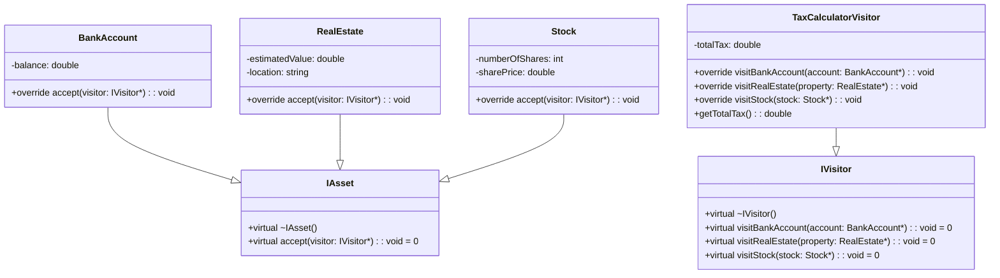

```mermaid
classDiagram
    class IAsset {
        +virtual ~IAsset()
        +virtual accept(visitor: IVisitor*): void = 0
    }

    class BankAccount {
        -balance: double
        +override accept(visitor: IVisitor*): void
    }

    class RealEstate {
        -estimatedValue: double
        -location: string
        +override accept(visitor: IVisitor*): void
    }

    class Stock {
        -numberOfShares: int
        -sharePrice: double
        +override accept(visitor: IVisitor*): void
    }

    BankAccount --|> IAsset
    RealEstate --|> IAsset
    Stock --|> IAsset

    class IVisitor {
        +virtual ~IVisitor()
        +virtual visitBankAccount(account: BankAccount*): void = 0
        +virtual visitRealEstate(property: RealEstate*): void = 0
        +virtual visitStock(stock: Stock*): void = 0
    }

    class TaxCalculatorVisitor {
        -totalTax: double
        +override visitBankAccount(account: BankAccount*): void
        +override visitRealEstate(property: RealEstate*): void
        +override visitStock(stock: Stock*): void
        +getTotalTax(): double
    }

    TaxCalculatorVisitor --|> IVisitor
```