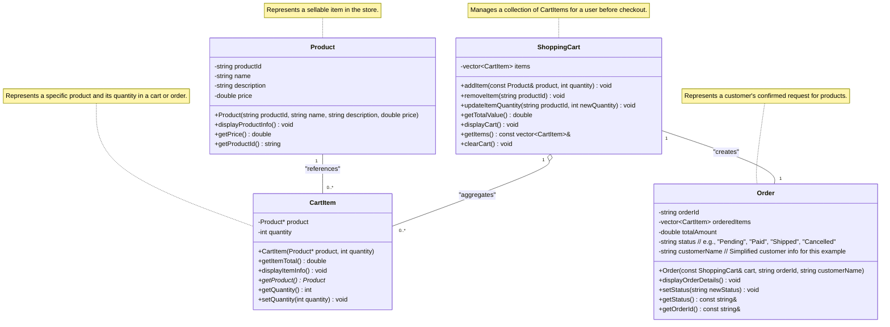

```mermaid
classDiagram
    class Product {
        -string productId
        -string name
        -string description
        -double price
        +Product(string productId, string name, string description, double price)
        +displayProductInfo() void
        +getPrice() double
        +getProductId() string
    }

    class CartItem {
        -Product* product
        -int quantity
        +CartItem(Product* product, int quantity)
        +getItemTotal() double
        +displayItemInfo() void
        +getProduct() Product*
        +getQuantity() int
        +setQuantity(int quantity) void
    }

    class ShoppingCart {
        -vector~CartItem~ items
        +addItem(const Product& product, int quantity) void
        +removeItem(string productId) void
        +updateItemQuantity(string productId, int newQuantity) void
        +getTotalValue() double
        +displayCart() void
        +getItems() const vector~CartItem~&
        +clearCart() void
    }

    class Order {
        -string orderId
        -vector~CartItem~ orderedItems
        -double totalAmount
        -string status  // e.g., "Pending", "Paid", "Shipped", "Cancelled"
        -string customerName // Simplified customer info for this example
        +Order(const ShoppingCart& cart, string orderId, string customerName)
        +displayOrderDetails() void
        +setStatus(string newStatus) void
        +getStatus() const string&
        +getOrderId() const string&
    }

    Product "1" -- "0..*" CartItem : "references"
    ShoppingCart "1" o-- "0..*" CartItem : "aggregates"
    ShoppingCart "1" -- "1" Order : "creates"

    %% Notes can be added for clarity
    note for Product "Represents a sellable item in the store."
    note for CartItem "Represents a specific product and its quantity in a cart or order."
    note for ShoppingCart "Manages a collection of CartItems for a user before checkout."
    note for Order "Represents a customer's confirmed request for products."
```