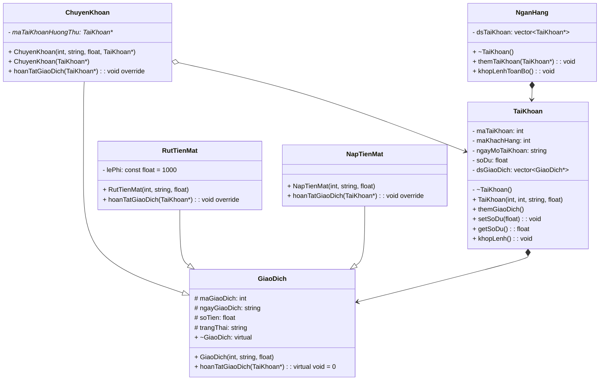

```mermaid
classDiagram
    class TaiKhoan {
        - maTaiKhoan: int
        - maKhachHang: int
        - ngayMoTaiKhoan: string
        - soDu: float
        - dsGiaoDich: vector~GiaoDich*~
        - ~TaiKhoan()
        + TaiKhoan(int, int, string, float)
        + themGiaoDich()
        + setSoDu(float): void
        + getSoDu(): float
        + khopLenh(): void
    }
    TaiKhoan *--> GiaoDich

    class GiaoDich {
        # maGiaoDich: int
        # ngayGiaoDich: string
        # soTien: float
        # trangThai: string
        + ~GiaoDich: virtual
        + GiaoDich(int, string, float)
        + hoanTatGiaoDich(TaiKhoan*): virtual void = 0
    }

    class RutTienMat {
        - lePhi: const float = 1000
        + RutTienMat(int, string, float)
        + hoanTatGiaoDich(TaiKhoan*): void override
    }
    RutTienMat --|> GiaoDich

    class NapTienMat {
        + NapTienMat(int, string, float)
        + hoanTatGiaoDich(TaiKhoan*): void override
    }
    NapTienMat --|> GiaoDich

    class ChuyenKhoan {
        - maTaiKhoanHuongThu: TaiKhoan**
        + ChuyenKhoan(int, string, float, TaiKhoan*)
        + ChuyenKhoan(TaiKhoan*)
        + hoanTatGiaoDich(TaiKhoan*): void override
    }
    ChuyenKhoan --|> GiaoDich
    ChuyenKhoan o--> TaiKhoan

    class NganHang {
        - dsTaiKhoan: vector~TaiKhoan*~
        + ~TaiKhoan()
        + themTaiKhoan(TaiKhoan*): void
        + khopLenhToanBo(): void
    }
    NganHang *--> TaiKhoan
```