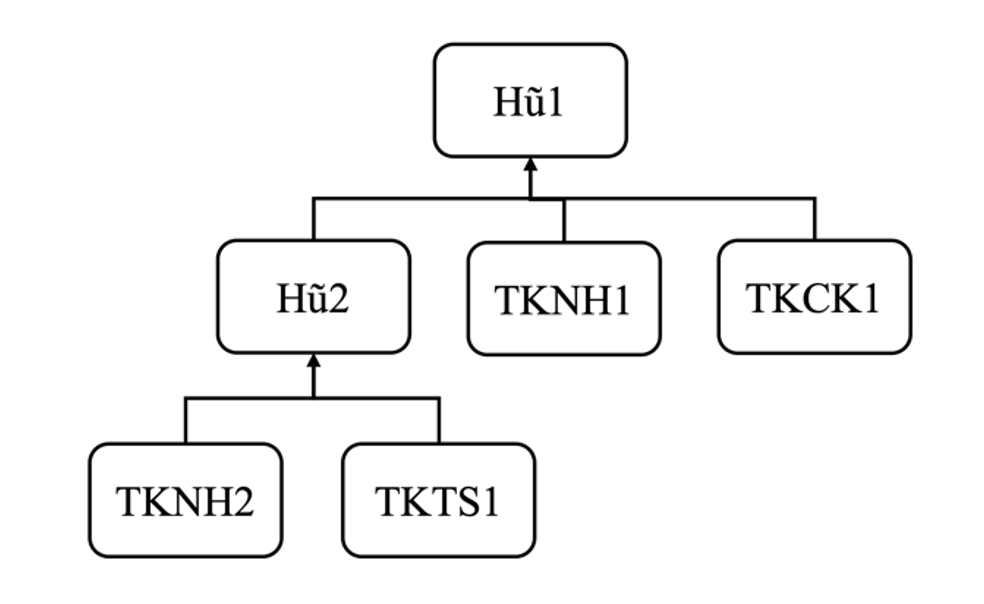

Bạn được yêu cầu xây dựng một ứng dụng quản lý tài chính cá nhân. 
Mỗi người dùng có thể sở hữu một danh mục bao gồm nhiều loại tài khoản khác nhau: tài khoản Ngân hàng (thông tin bao gồm Tên ngân hàng, Số dư), tài khoản Chứng khoán (thông tin bao gồm Mã cổ phiếu, Số lượng, Giá cổ phiếu), tài khoản Tiền số (thông tin bao gồm Mã tiền số, Số dư, Tỉ giá). Giá trị mỗi tài khoản được tính toán như sau:

- Tài khoản Ngân hàng: Số dư
- Tài khoản Chứng khoán: Số lượng * Giá cổ phiếu
- Tài khoản Tiền số: Số dư * Tỉ giá

Ứng dụng có 2 loại người dùng: người dùng thường và người dùng VIP. Người dùng thường có các chức năng: thêm một tài khoản (chỉ được tạo tối đa 10 tài khoản), chức năng thống kê danh sách tài khoản (bao gồm thông tin chi tiết của từng tài khoản), và chức năng thống kê tổng giá trị của các tài khoản. Ngoài các chức năng của người dùng thường, người dùng VIP còn được hỗ trợ thêm các chức năng: không giới hạn số lượng tài khoản được tạo, thống kê tổng giá trị của các tài khoản theo loại tài khoản.

a)	(2 điểm) Hãy áp dụng các tính chất hướng đối tượng đã học để vẽ sơ đồ lớp (class) thể hiện các lớp và quan hệ (relationship) giữa các lớp. Ghi rõ các thuộc tính (attribute) và các hàm (method) cần có trong mỗi lớp.
 
b)	(2 điểm) Cài đặt chi tiết các hàm liên quan chức năng thống kê tổng giá trị của các tài khoản (in ra màn hình).

c)	(1 điểm) Việc quản lý trực tiếp danh mục tài khoản có thể gây khó khăn cho người dùng đặc biệt khi số lượng tài khoản lớn. Hũ tài chính được đề xuất để giải quyết vấn đề này. Hũ tài chính được thiết kế theo dạng cây, mỗi hũ sẽ chứa danh sách các tài khoản và các hũ con nếu có. Thông tin chi tiết của một hũ sẽ bao gồm thông tin chi tiết của các thành phần con, giá trị của hũ sẽ là tổng giá trị của các thành phần con. Bạn sẽ thay đổi hay bổ sung thêm cho các lớp đối tượng như thế nào? Hãy giải thích và minh họa thêm trên sơ đồ lớp ở câu a.
