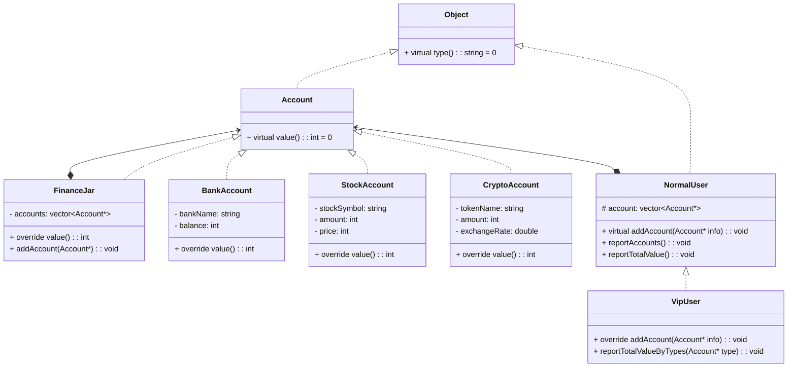

```mermaid
classDiagram
    class Object {
        + virtual type(): string = 0
    }

    class FinanceJar {
        - accounts: vector~Account*~
        + override value(): int
        + addAccount(Account*): void
    }

    class Account {
        + virtual value(): int = 0
    }

    class BankAccount {
        - bankName: string
        - balance: int
        + override value(): int
    }
    class StockAccount {
        - stockSymbol: string
        - amount: int
        - price: int
        + override value(): int
    }
    class CryptoAccount {
        - tokenName: string
        - amount: int
        - exchangeRate: double
        + override value(): int
    }

    NormalUser <|.. VipUser
    class NormalUser {
        # account: vector~Account*~
        + virtual addAccount(Account* info): void
        + reportAccounts(): void
        + reportTotalValue(): void
    }

    class VipUser {
        + override addAccount(Account* info): void
        + reportTotalValueByTypes(Account* type): void
    }

    Object <|.. Account
    Object <|.. NormalUser

    Account <|.. BankAccount
    Account <|.. StockAccount
    Account <|.. CryptoAccount
    Account <|.. FinanceJar

    Account <--* NormalUser
    Account <--* FinanceJar
```